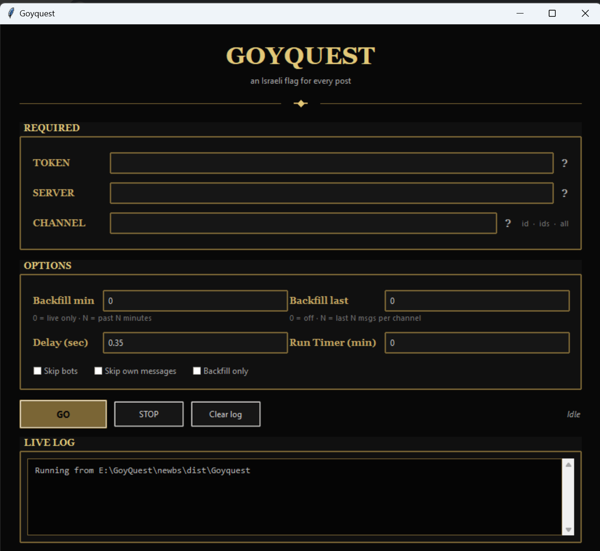

# Goyquest

Lightweight CLI tool that reacts to Discord channel messages with an emoji (🇮🇱 by default) using the raw Discord HTTP API and Gateway WebSocket — no `discord.py`.

## What it does

- **Live (default)** — watches for new messages via WebSocket and reacts in real time
- **Backfill (optional)** — react to recent messages by time (`--minutes`) or message count (`--last`)
- **Run timer (optional)** — stop automatically after N minutes, or run until Ctrl+C (default)
- **Flexible targeting** — one channel, comma-separated channels, or `--channel all` for every accessible text channel in a server
- **Permission-aware** — skips channels where your account cannot add reactions (no repeated 403 spam)

## Requirements

- Python 3.10+
- Dependencies in `requirements.txt`
- Your Discord user token and server ID
- A channel ID, comma-separated channel IDs, or `all` for `--channel`

## Setup

```powershell
cd goyquest
python -m pip install -r requirements.txt
```

## Getting your token

To get the token for your personal account:

> Automating user accounts is technically against TOS — use at your own risk!

1. Open Discord in your web browser and login
2. Open any server or direct message channel
3. Press Ctrl+Shift+I to show developer tools
4. Navigate to the Network tab
5. Press Ctrl+R to reload
6. Switch between random channels to trigger network requests
7. Search for a request that starts with `messages`
8. Select the Headers tab on the right
9. Scroll down to the Request Headers section
10. Copy the value of the `authorization` header

## Getting channel and server IDs

You always need a server ID for `--server`. You only need channel IDs if you are **not** using `--channel all`.

1. Open Discord (desktop app or web browser)
2. Click the gear icon next to your username to open **User Settings**
3. Go to **Advanced** in the left sidebar
4. Turn on **Developer Mode**
5. Close settings

**Server ID:**

1. In the server list on the left, right-click the server icon (the circular image)
2. Click **Copy Server ID**
3. Paste it into `--server` (e.g. `--server 1111111111111111111`)

**Channel ID** (skip if using `--channel all`):

1. Right-click the text channel name in the channel list
2. Click **Copy Channel ID**
3. Paste it into `--channel` (e.g. `--channel 1234567890123456789`)

For multiple channels, copy each channel ID and separate them with commas:

`--server 1111111111111111111 --channel 1234567890123456789,9876543210987654321`

## Usage

**Single channel (live only — default):**

```powershell
python react_http.py --token YOUR_TOKEN --server 1111111111111111111 --channel 1234567890123456789
```

Or:

```powershell
.\run.ps1 --token YOUR_TOKEN --server 1111111111111111111 --channel 1234567890123456789
```

**Multiple channels (comma-separated):**

```powershell
python react_http.py --token YOUR_TOKEN --server 1111111111111111111 --channel 1234567890123456789,9876543210987654321
```

**All text channels in the server:**

```powershell
python react_http.py --token YOUR_TOKEN --server 1111111111111111111 --channel all
```

`--channel all` (alias: `--channels all`) discovers every text and announcement channel in the server. Channels you cannot read are skipped during setup. Channels you can read but cannot react in are skipped after the first permission error.

**Run timer (optional):**

```powershell
python react_http.py --token YOUR_TOKEN --server 1111111111111111111 --channel 1234567890123456789                # run until Ctrl+C (default)
python react_http.py --token YOUR_TOKEN --server 1111111111111111111 --channel 1234567890123456789 --timer 30   # stop after 30 minutes
```

The timer counts from script start and applies to backfill and live listening.

**Backfill by time (optional, in minutes):**

```powershell
python react_http.py --token YOUR_TOKEN --server 1111111111111111111 --channel 1234567890123456789                    # live only (default)
python react_http.py --token YOUR_TOKEN --server 1111111111111111111 --channel 1234567890123456789 --minutes 60   # backfill last 60 minutes, then live
python react_http.py --token YOUR_TOKEN --server 1111111111111111111 --channel 1234567890123456789 --minutes 1440 # backfill last 24 hours, then live
```

**Backfill by message count:**

```powershell
python react_http.py --token YOUR_TOKEN --server 1111111111111111111 --channel 1234567890123456789 --last 30
python react_http.py --token YOUR_TOKEN --server 1111111111111111111 --channel all --last 20
```

Use `--minutes` or `--last`, not both. Both apply per channel. Use `--delay` to slow backfill if you hit rate limits (e.g. `--delay 1`).

**Backfill only (no WebSocket):**

```powershell
python react_http.py --token YOUR_TOKEN --server 1111111111111111111 --channel 1234567890123456789 --last 30 --backfill-only
```

**Backfill, then live, with a run timer:**

```powershell
python react_http.py --token YOUR_TOKEN --server 1111111111111111111 --channel 1234567890123456789 --minutes 60 --timer 120
```

Backfills the last 60 minutes, then listens for new messages, and stops after 120 minutes total (including backfill).

**Validate token and server access (no reactions, no WebSocket):**

```powershell
python react_http.py --token YOUR_TOKEN --server 1111111111111111111 --channel 1234567890123456789 --backfill-only
```

Checks your token, server, and channel access via the REST API, then exits. With `--channel all`, this resolves all accessible channels without backfilling (unless `--minutes` or `--last` is also set).

## CLI flags

| Flag | Default | Description |
|------|---------|-------------|
| `--token` | *(required)* | User token |
| `--channel`, `--channels` | *(required)* | Channel ID(s), comma-separated, or `all` |
| `--guild`, `--server` | *(required)* | Server ID — channels must belong to this server |
| `--emoji` | 🇮🇱 | Emoji to react with |
| `--minutes` | `0` | Backfill messages from the last N minutes (`0` = skip) |
| `--last` | `0` | Backfill the last N messages per channel (`0` = skip) |
| `--delay` | `0.35` | Seconds between reactions during backfill |
| `--skip-bots` | off | Ignore messages from bots |
| `--skip-self` | off | Skip your own messages |
| `--backfill-only` | off | Backfill then exit (no live WebSocket) |
| `--timer` | `0` | Stop after N minutes (`0` = run until Ctrl+C) |

`--minutes` and `--last` are mutually exclusive.

### Environment variables

| Environment variable | CLI flag |
|---------------------|----------|
| `DISCORD_TOKEN` | `--token` |
| `DISCORD_CHANNEL` | `--channel` (comma-separated IDs or `all`) |
| `DISCORD_GUILD` | `--server` / `--guild` |
| `DISCORD_EMOJI` | `--emoji` |
| `BACKFILL_MINUTES` | `--minutes` |
| `BACKFILL_LAST` | `--last` |
| `RUN_MINUTES` | `--timer` |

If `DISCORD_TOKEN`, `DISCORD_GUILD`, and `DISCORD_CHANNEL` are set, you can omit `--token`, `--server`, and `--channel` on the command line. Put secrets in a `.env` file locally — it is gitignored.

## How it works

| Phase | Method |
|-------|--------|
| Auth | `Authorization: <token>` on REST requests (Chrome user-agent) |
| Backfill | `GET /channels/{id}/messages` → `PUT .../reactions/{emoji}/@me` |
| Live | Gateway WebSocket `MESSAGE_CREATE` → `PUT` reaction |
| Rate limits | On HTTP 429, waits for Discord's `retry_after` before retrying |
| Permissions | On HTTP 403 missing react permission, skips that channel for the rest of the run |

## Project layout

```
goyquest/
├── react_http.py    # CLI (main script)
├── requirements.txt
├── run.ps1          # PowerShell CLI launcher
├── newbs/           # Windows GUI + exe build (see below)
├── .gitignore
└── README.md
```

## Windows GUI (`newbs/`)



The `newbs/` folder is a **separate Windows app** for people who do not want the command line. It wraps the same `react_http.py` logic in a form: fill in token, server, and channel, set optional flags, press **Go**, and watch the live log. It always reacts with 🇮🇱 (no emoji setting in the GUI).

**End users:** download `Goyquest-windows.zip` from [GitHub Releases](https://github.com/UnityEQ/GoyQuest/releases), extract the `Goyquest` folder, and run `Goyquest.exe`. Keep `_internal` next to the exe.

**Build locally (Windows):**

```powershell
cd newbs
.\build.ps1
```

Output: `newbs\dist\Goyquest\Goyquest.exe` (ship the whole `Goyquest` folder, or zip it with `.\package_release.ps1`).

**Dev without building:**

```powershell
cd newbs
.\dev.ps1
```

Requires Python 3.10+ and `pip install -r newbs\requirements.txt`. Build deps: `requirements-build.txt` (PyInstaller).

More build and antivirus notes: `newbs/BUILD.txt`.

### GitHub Releases

**Automatic (recommended):** push a version tag and GitHub Actions builds and uploads the zip:

```powershell
git tag v1.0.0
git push origin v1.0.0
```

The workflow in `.github/workflows/release.yml` runs on tags like `v1.0.0`, builds the Windows GUI, and attaches `Goyquest-windows.zip` to the release.

**Manual:** after `.\build.ps1`, run `.\package_release.ps1`, then on GitHub go to **Releases → Draft a new release**, pick a tag, and upload `newbs\dist\Goyquest-windows.zip`.

## Random findings

Anecdotal things we've run into while using this — not official Discord policy, but worth knowing:

**Join servers before you run, not one-by-one after kicks**

If you get kicked or removed from a channel (or a couple of them), Discord may temporarily restrict your account from joining **new** servers or channels for roughly **24–48 hours**. That lockout is easy to hit if you join a server, run the script, get kicked, then immediately join another server and repeat.

Safer approach:

1. Join all the servers you plan to use **first**
2. Let your account settle in those servers
3. Then run Goyquest across the channels you already have access to

Avoid the loop of "join server → run script → get kicked → join next server" in quick succession.

## Notes

- Automating a user account may violate Discord's Terms of Service. Use at your own risk.
- Do not commit tokens to public repositories.
- Press **Ctrl+C** in the terminal to stop early (even when `--timer` is set).
- Reading messages and adding reactions require different permissions. A channel may appear in `--channel all` but still be skipped if your role cannot add reactions.
- Discord rate limits are dynamic. If you see frequent slowdowns or 429 responses during backfill, increase `--delay` (try `1`–`2` seconds).
- Windows PowerShell may not display 🇮🇱 in the console; reactions still work on Discord.